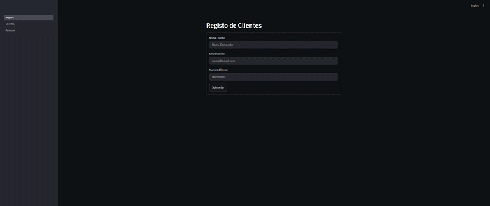

# 🚀 DSIcréditos Freamunde: Sistema de Registo de Clientes

<!-- Adicione aqui um banner ou logo do projeto, se houver. Ex:  -->

## 📝 Descrição Curta
Aplicação web em **Python** com **Streamlit** para gerir clientes da DSIcréditos Freamunde. Permite adicionar, ver e remover clientes, guardando os dados em **ficheiros de texto**.

## 🎬 Demonstração

Veja a aplicação em ação:

*   **GIF/Vídeo de Demonstração:** 

## � Tecnologias

Este projeto utiliza as seguintes tecnologias:

*   **Python**: Linguagem de programação.
    
*   **Streamlit**: Framework para construção rápida de aplicações web interativas.
    
*   **Pandas**: Biblioteca para manipulação e análise de dados (usada para exibir a lista de clientes).
    !Pandas

## 📦 Instalação

Para instalar e usar:

1.  **Clone o repositório:**
    ```bash
    git clone https://github.com/seu-usuario/seu-repositorio.git
    cd seu-repositorio
    ```
2.  **Crie e ative um ambiente virtual:**
    ```bash
    python -m venv venv
    source venv/bin/activate  # Windows: `venv\Scripts\activate`
    ```
3.  **Instale as dependências:**
    ```bash
    pip install streamlit pandas
    ```
4.  **Ficheiro de Dados:**
    *   O ficheiro `clientes.txt` será criado automaticamente para guardar os dados dos clientes.

## ▶️ Como usar

Para iniciar a aplicação:
```bash
streamlit run Registo.py
```
Interaja com a interface para cadastrar clientes no evento.

## 🗄️ Banco de Dados
A aplicação utiliza MariaDB para armazenar os registros. O script de inicialização do banco está incluído no diretório principal.
